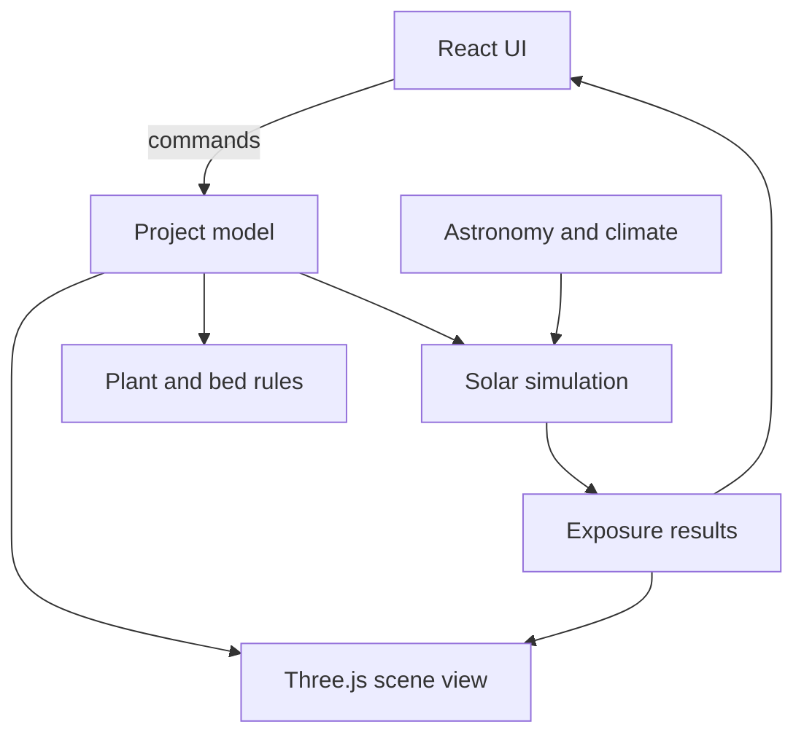

# Landscape Planner — Foundational Project Plan

## 1. Product vision

Landscape Planner is a browser-based, local-first application for designing a
residential yard in 3D and answering practical questions about the design.

The intended capabilities are:

- Create and position simplified 3D representations of terrain, structures,
  hardscape, planting beds, plants, canopies, fences, and trellises.
- Calculate direct solar exposure and diffuse exposure from an anisotropic sky
  separately across exposed surfaces.
- Inspect conditions at a particular date and solar time.
- Accumulate exposure over a selected month, season, or year using latitude and
  a selectable climate model.
- Update results progressively and near real time as objects move, using available
  CPU and GPU resources.
- Support inch-scale final sampling on an acre-scale lot without pretending the
  entire property can always be recalculated at that resolution during a drag.
- Represent uncertainty in property boundaries and, later, other scene measurements.
- Define planting beds, soil domains, and irrigation groupings independently.
- Flag beneficial, detrimental, or incompatible plant relationships using rules
  that retain evidence and confidence information.

This is not intended to be a production SaaS application. Initial priorities are
correctness, transparency, a satisfying local editing experience, and a codebase
that another hobbyist can understand and run.

## 2. Foundational decisions

These are current architectural decisions, not benchmark claims:

1. Build a browser application rather than a native desktop application.
2. Use TypeScript, React, Vite, and Three.js.
3. Prefer Three.js `WebGPURenderer`; target WebGPU compute for the accelerated
   visibility solver.
4. Keep authoritative domain state independent of Three.js and React.
5. Use a local Cartesian coordinate system and SI units internally.
6. Store projects as versioned, serializable JSON.
7. Preserve direct and diffuse radiation as separate result channels.
8. Model the direct solar disk separately from the diffuse sky dome.
9. Start with parametric primitives and terrain/parcel surfaces, not arbitrary
   imported meshes.
10. Sample exposure on actual surfaces rather than in a 3D voxel volume.
11. Retain a CPU reference implementation after adding GPU acceleration.
12. Use progressive resolution, directional aggregation, and spatial invalidation
    to meet interactive performance goals.
13. Model soil, irrigation, foliage proximity, shading, pests, disease, and other
    plant relationships as separate domains.
14. Attach confidence and citations to horticultural relationship claims.
15. Make geometric uncertainty visible and machine-readable.

The numerical quality tiers in this plan are starting hypotheses. Benchmark them
on representative hardware before treating them as defaults or guarantees.

## 3. Architecture

The application should be divided into systems with explicit data boundaries:



### 3.1 Application shell

React owns menus, inspectors, dialogs, time/quality controls, and component
lifecycle. Three.js owns the rendered scene, camera, picking, and render loop.
High-volume numerical arrays should not be copied through React state every frame.

### 3.2 Project model

The project model is the authoritative, serializable state. It contains entities,
transforms, geometry parameters, semantic metadata, climate configuration, and
project settings. Three.js objects are disposable views derived from it.

### 3.3 Solar simulation

The solar system contains independently testable layers:

1. solar position
2. climate and irradiance
3. direct-sun directional weights
4. diffuse-sky patch weights
5. scene visibility/transmission
6. surface sampling and accumulation
7. progressive scheduling and invalidation

### 3.4 Plant and bed rules

The horticultural engine evaluates explicit rules against spatial and membership
relationships derived from the project model. It does not depend on Three.js mesh
types or visual overlap.

### 3.5 Persistence

Use versioned JSON as the canonical interchange format. Local autosave can later
use IndexedDB or OPFS, but the in-memory model should not depend on a particular
storage API. Include schema versioning and migrations before users accumulate
valuable project files.

## 4. Coordinate and unit conventions

Adopt the convention below before creating persisted scenes:

| Quantity | Convention |
| --- | --- |
| Length | meters internally |
| Irradiance | W/m² |
| Accumulated radiant exposure | kWh/m² |
| +X | east |
| +Y | up |
| -Z | north |
| Angles | radians internally unless an API documents otherwise |
| User display | selectable metric or US customary |

The local origin may be a convenient parcel reference point. Geographic latitude
is meaningful to astronomy, while `northRotation` or source-alignment metadata
connects imported/sketched geometry to true north.

Keep these three resolutions distinct:

- **Geometric precision:** how precisely locations and dimensions are stored.
- **Calculation resolution:** surface-sample spacing used for a solver pass.
- **Display resolution:** how results are interpolated and visualized.

An object can be positioned to sub-inch precision without requiring every
interactive calculation to use one-inch samples.

## 5. Domain model

Favor component-style composition over a hierarchy such as
`Tree extends Plant extends LandscapeObject`.

An illustrative entity shape is:

```ts
interface Entity {
  id: string
  name: string
  transform: Transform
  geometry?: GeometryComponent
  appearance?: AppearanceComponent
  solarOptics?: SolarOpticsComponent
  semantic?: SemanticComponent
  plant?: PlantComponent
  plantingBed?: PlantingBedComponent
  bedMembership?: BedMembershipComponent
  irrigationZone?: IrrigationZoneComponent
  irrigationMembership?: IrrigationMembershipComponent
}
```

This is a design sketch, not a requirement to create one large interface. Prefer
discriminated unions and focused maps/collections if they make validation and
serialization clearer.

### 5.1 Geometry

Initial supported primitives should be intentionally constrained:

- ground plane and polygonal parcel
- box
- wall or fence segment
- polygon extrusion
- cylinder
- sphere or ellipsoid
- terrain height field
- canopy
- trellis or transmissive screen

Arbitrary OBJ/glTF meshes are deferred because reliable surface parameterization
for quantitative, inch-scale exposure maps is a separate large problem.

### 5.2 Solar optics

Solar optics are independent of visible materials:

```ts
type SolarOptics =
  | { mode: 'ignored' }
  | { mode: 'opaque' }
  | { mode: 'transmissive'; transmittance: number }
```

For the initial transmissive model, each crossing multiplies ray transmission:

\[
T_{new} = T_{old}\,\tau
\]

Two crossings with transmittances 0.5 and 0.4 therefore yield total transmission
of 0.2. A later optional volume model may use Beer–Lambert-style attenuation,
\(T = e^{-k\ell}\), so longer canopy paths attenuate more strongly.

### 5.3 Beds and irrigation

Beds and irrigation zones are explicit domains:

```text
PlantingBed
  geometry or volume
  soil profile
  amendments
  drainage
  usable root depth

IrrigationZone
  explicit members and/or geometry
  water characteristics
  schedule metadata
```

Foliage proximity must not imply shared soil, and shared irrigation must not imply
shared soil. These distinctions are central to meaningful plant guidance.

### 5.4 Boundary uncertainty

Represent a boundary segment with its geometry, source, and an uncertainty corridor:

```ts
interface BoundarySegment {
  start: Point2
  end: Point2
  source: 'survey' | 'gis' | 'fence' | 'estimated' | 'user'
  uncertaintyMeters: number
}
```

The interface can classify an object as definitely inside, uncertain/possibly
outside, or definitely outside. Do not imply survey accuracy for a fence line or
hand-drawn parcel.

Later, the same pattern can describe uncertain tree position, height, or canopy
size. A small ensemble of perturbed simulations could then report expected,
minimum-plausible, and maximum-plausible exposure.

## 6. Solar and sky model

### 6.1 Quantities

For surface point \(x\), normal \(n\), and sun direction \(s_t\), instantaneous
direct irradiance is modeled as:

\[
E_{direct}(x,t)=DNI(t)\max(0,n\cdot s_t)T(x,s_t)
\]

where \(T\) is path transmission from zero to one.

Diffuse-sky irradiance is:

\[
E_{sky}(x,t)=\int_{\Omega}L(\omega,t)\max(0,n\cdot\omega)
T(x,\omega)\,d\omega
\]

Internally preserve:

- instantaneous direct irradiance, W/m²
- instantaneous diffuse irradiance, W/m²
- accumulated direct exposure, kWh/m²
- accumulated diffuse exposure, kWh/m²

Derived displays may include direct-sun hours, equivalent full-sun hours,
percentage of unobstructed exposure, average daily exposure, and horticultural
sun/shade categories.

### 6.2 Solar position and time

Use a validated solar-position implementation rather than a simplified seasonal
declination formula. Initial point-in-time input can use date, latitude, local
solar time, and scene north. Supporting civil clock time additionally requires
longitude and time-zone rules.

Suggested project fields:

```text
latitude
longitude?       optional until civil-time mode
timeZone?        optional until civil-time mode
elevation?       optional
northRotation
```

### 6.3 Climate abstraction

Average cloud fraction does not uniquely determine direct-normal irradiance,
diffuse-horizontal irradiance, or an anisotropic sky distribution. Keep that
conversion behind an interface:

```ts
interface ClimateModel {
  getDNI(instant: SimulationInstant): number
  getDHI(instant: SimulationInstant): number
  getSkyRadiance(
    instant: SimulationInstant,
    patch: SkyPatch,
  ): number
}
```

Implementations can evolve independently:

- **Synthetic climate:** latitude, monthly/seasonal average cloud fraction, and
  optional atmospheric clarity. Clearly label output as modeled climatology.
- **Weather-data climate:** later accept EPW, TMY, NSRDB-derived, or user CSV
  data containing direct and diffuse radiation.

### 6.4 Anisotropic sky

Start with a 145-patch Tregenza hemisphere for diffuse light. Potential quality
tiers may later use 578 or 2305 Reinhart patches.

The direct solar disk remains a separate directional source. Putting it into a
large diffuse patch would smear its angular size and produce incorrect shadows.

Verify diffuse normalization numerically. For an unobstructed horizontal surface:

\[
DHI \approx \sum_k L_k\cos(\theta_k)\Delta\Omega_k
\]

If that relationship does not close within the chosen discretization tolerance,
the diffuse result is not trustworthy.

## 7. Accumulation and performance strategy

### 7.1 Pre-integrate time before repeated visibility work

Do not trace every surface sample at every five-minute timestamp whenever an
object moves.

For accumulated direct exposure, cluster similar sun directions. For direction
bin \(j\):

\[
W_j=\sum_{t\in j} DNI(t)\Delta t
\]

Then evaluate:

\[
H_{direct}(x)\approx\sum_j W_j\max(0,n\cdot s_j)T(x,s_j)
\]

For diffuse exposure, integrate each sky patch's radiance over the selected
period:

\[
A_k=\int L_k(t)dt
\]

Then evaluate:

\[
H_{sky}(x)\approx\sum_k A_k\max(0,n\cdot\omega_k)
T(x,\omega_k)\Delta\Omega_k
\]

Moving geometry then changes directional visibility, not the astronomical and
weather integration.

### 7.2 Surface sampling

Generate exposure samples/lightmaps on actual exposed surfaces. Each sample or
texel needs enough information to recover:

- world position
- world normal
- owning entity and surface
- sample area or integration weight
- direct result
- diffuse result
- quality/provenance metadata

Parametric primitives are valuable because their surface parameterization is
known and stable.

### 7.3 Progressive quality

A plausible starting hierarchy is:

| Mode | Surface spacing | Direct directions | Sky patches |
| --- | ---: | ---: | ---: |
| Drag preview | 6–12 in | 24–32 | 145 |
| Interactive | 3–6 in | 64–128 | 145 |
| Refined | 1–2 in | 256–512 | 578 |
| Analysis/export | user-selected to 1 in | 1000+ | up to 2305 |

These are hypotheses to benchmark, not promises. The result should visibly refine
after manipulation stops, while point probes can perform a precise local ray query.

### 7.4 Spatial invalidation

Partition exposure surfaces into tiles, initially perhaps 128×128 or 256×256
samples. Moving an object should dirty only tiles whose rays could have changed,
based on:

- the object's old and new bounds
- the active direct-sun direction set
- active diffuse directions
- the affected surface bounds

Begin with conservative invalidation. Optimize its tightness only after profiling.

### 7.5 CPU and GPU solvers

Build the CPU reference solver first:

```text
surface sample + direction
  -> scene intersection traversal
  -> ordered optical crossings
  -> path transmission
```

It may be slow, but it should be simple, deterministic, and independently testable.

The production GPU kernel can later assign work across combinations of surface
samples and illumination directions and traverse a GPU-packed scene BVH. Keep the
CPU solver as ground truth for small scenes and randomized differential tests.

Ordinary Three.js shadow rendering can provide immediate visual feedback before
the quantitative ray solver is ready. It must not be mistaken for the authoritative
exposure calculation.

## 8. Plant relationship engine

Represent interactions as data, not fields such as `tomato.goodNeighbor = basil`.

An illustrative rule is:

```ts
interface PlantInteractionRule {
  sourceTaxon: string
  targetTaxon: string
  direction: 'directed' | 'symmetric'
  effectType:
    | 'pest'
    | 'disease'
    | 'nutrientCompetition'
    | 'allelopathy'
    | 'pollination'
    | 'irrigationCompatibility'
    | 'structuralSupport'
    | 'shading'
  polarity: 'beneficial' | 'detrimental' | 'contextDependent'
  domain:
    | { type: 'foliageProximity'; maxDistanceMeters: number }
    | { type: 'sharedSoil' }
    | { type: 'sharedIrrigationZone' }
    | { type: 'solarEffect' }
  strength: 'weak' | 'moderate' | 'strong'
  confidence: 'low' | 'medium' | 'high'
  conditions?: Record<string, unknown>
  sources: SourceReference[]
  notes?: string
}
```

Likely relationship domains include:

- foliage distance
- root or soil sharing
- irrigation sharing
- shading
- pest interaction
- disease interaction
- pollination
- nutrient competition
- allelopathy
- structural/support relationships

Warnings should explain which domain triggered the rule and communicate evidence
quality. A documented incompatibility should not look equivalent to a commonly
repeated but weakly supported companion-planting claim.

## 9. Development roadmap

### Milestone 1 — Navigable WebGPU scene

Deliver:

- full-window renderer
- perspective camera and orbit controls
- ground plane, reference grid, and diagnostic block
- lighting sufficient to read the geometry
- resize handling and resource cleanup
- lint and production build passing

Acceptance criterion: a user can open the local app, orbit, zoom, pan, and resize
without errors or distortion.

### Milestone 2 — Coordinate and parcel foundation

Deliver:

- documented coordinate convention and unit helpers
- true-north indicator
- parameterized rectangular parcel, then polygon parcel
- visible property boundary
- uncertainty corridor data and basic visualization
- metric/US-customary input-display conversion without changing stored units

### Milestone 3 — Domain/scene separation

Deliver:

- minimal versioned project schema
- domain objects independent of Three.js
- view synchronization from domain state
- object IDs and a small command/update API
- round-trip serialization test

Do this before selection and editing create many implicit scene-graph assumptions.

### Milestone 4 — Primitive editing

Deliver:

- create box, cylinder, wall/fence, polygon extrusion, and canopy
- select by clicking
- translate, rotate, and resize
- numeric property inspector
- snapping appropriate to the current task
- undo/redo at the command level

### Milestone 5 — Save and load

Deliver:

- download/upload project JSON first
- schema validation with useful errors
- schema version and migration seam
- local autosave/recovery later in this milestone

### Milestone 6 — CPU point solar reference

Deliver:

- validated solar position
- point query for direct incidence
- CPU ray visibility
- opaque and constant-transmittance occluders
- small analytical fixture suite
- numerical result panel at a selected date and solar time

### Milestone 7 — Instant surface exposure

Deliver:

- surface sampling/atlas for supported primitives
- instantaneous direct result heatmap
- date and solar-time controls
- quantitative probe tool
- separate direct, diffuse placeholder, and total display channels

### Milestone 8 — Accumulated direct exposure

Deliver:

- temporal sampling over a chosen period
- sun-direction clustering and energy weights
- progressive surface resolution
- conservative tile invalidation
- visible result quality/progress metadata

This milestone proves the central performance architecture.

### Milestone 9 — Anisotropic diffuse sky

Deliver:

- Tregenza patch generation and solid-angle data
- climate-model interface
- initial synthetic climate model
- anisotropic per-patch radiance
- temporal patch integration
- diffuse visibility and heatmap
- DHI closure/normalization tests

### Milestone 10 — WebGPU acceleration

Deliver:

- GPU-ready scene geometry/BVH representation
- batched visibility/transmission kernel
- CPU-versus-GPU differential tests
- capability detection and safe fallback
- benchmarks across representative scene sizes and quality tiers

GPU acceleration can be prototyped earlier if it de-risks the architecture, but it
must not replace the reference solver before correctness is established.

### Milestone 11 — Beds, irrigation, and plants

Deliver:

- bed geometry and soil metadata
- irrigation zones/membership
- plant entities and taxonomy identifiers
- foliage-distance and shared-domain queries
- evidence-aware interaction-rule format
- explainable warnings and recommendations

## 10. Early validation fixtures

Solar graphics can look convincing while being wrong. Establish analytical and
differential tests before optimization.

### 10.1 Solar geometry

- Compare selected solar positions against a trusted reference implementation.
- Test sunrise/sunset-adjacent behavior, leap days, and both hemispheres.
- Keep solar time and civil time distinct in types and interface labels.

### 10.2 Pole shadow

For a vertical pole 10 m high and solar altitude 45°, expected horizontal shadow
length is 10 m.

### 10.3 Surface orientation

Verify unobstructed horizontal, vertical south-facing, north-facing, and tilted
surfaces against the cosine-incidence calculation.

### 10.4 Transmission

At unobstructed direct irradiance of 800 W/m²:

- one 50% screen should yield 400 W/m²
- 50% followed by 40% should yield 160 W/m²
- an opaque crossing should yield 0 W/m²

Include grazing rays, rays originating near surfaces, and duplicate/coplanar
intersection cases.

### 10.5 Diffuse sky closure

Numerically integrate an unobstructed horizontal hemisphere and confirm that the
patch system reproduces the climate model's DHI within a documented tolerance.

### 10.6 Persistence

Round-trip representative projects through JSON and verify semantic equality.
Test migration from every retained historical schema version once migrations exist.

### 10.7 CPU/GPU agreement

For small deterministic and seeded-random scenes, compare path transmission and
accumulated results within explicit floating-point tolerances.

## 11. Performance measurement

Do not optimize against an empty scene alone. Create repeatable benchmark scenes:

- small suburban yard with house, fences, and several plants
- quarter-acre detailed yard
- one-acre stress scene
- dense overlapping transmissive canopies
- many small exposure surfaces versus a few large surfaces

Measure at least:

- frame time during object dragging
- time to first coarse exposure update
- time to interactive refinement
- time to one-inch final result
- peak CPU and GPU memory
- number of dirty surface tiles after representative edits
- CPU/GPU numerical disagreement

Record device, browser, resolution tier, scene statistics, and solver version with
benchmarks. Let measured performance determine automatic quality defaults.

## 12. Explicitly deferred scope

Do not let these block the core prototype:

- realistic individual leaves
- arbitrary imported-mesh exposure baking
- nearby-object reflected/scattered radiation
- spectral or photosynthetically active radiation modeling
- detailed plant growth simulation
- explicit root-system geometry
- soil-moisture transport
- automatic landscape optimization
- collaborative accounts or cloud sync
- mobile editing
- photogrammetry
- GIS parcel ingestion
- production-grade authentication or multi-user services

The model may leave seams for some of these, but no speculative framework is
required now.

## 13. Key risks and de-risking prototypes

| Risk | Early de-risking step |
| --- | --- |
| Full-lot resolution is too slow | Benchmark progressive surface tiles and direction bins before building a large editor |
| GPU and CPU disagree | Maintain analytical fixtures and randomized differential tests |
| Diffuse sky energy is mis-normalized | Require the unobstructed DHI closure test |
| Three.js becomes the database | Establish domain/view separation before full editing tools |
| Climate assumptions overstate accuracy | Keep a replaceable climate interface and label synthetic results |
| Imported meshes consume the project | Restrict early geometry to controlled primitives |
| Plant advice becomes folklore presented as fact | Store confidence, conditions, and citations with every rule |
| Property sketches imply survey precision | Visualize boundary-source metadata and uncertainty corridors |

The highest-value technical prototype after the scene editor is deliberately small:

> One sampled ground plane, one movable opaque box, and one transmissive ellipsoid,
> producing instant direct exposure, accumulated direct exposure, and 145-patch
> diffuse exposure with progressive refinement.

If that prototype performs acceptably at realistic lot size and sampling density,
the unusual core of the application is viable; most remaining work is conventional
editor, persistence, and domain-model engineering.

## 14. Open decisions

Resolve these with small experiments rather than extended speculation:

- Which solar-position library or in-house implementation gives the best balance
  of validation, bundle size, and maintainability?
- Which all-weather sky implementation should power the first synthetic climate
  model, and what inputs can users reasonably understand?
- Is direct-direction clustering best implemented with fixed angular bins,
  weighted clustering, or a solar-path-specific grid?
- Which surface atlas/tile size performs best on representative integrated GPUs?
- When should the project adopt a dedicated state or command library, if ever?
- Which GPU BVH representation and traversal code is sufficiently stable for the
  first accelerated prototype?
- What is the smallest useful horticultural data set with defensible sourcing?

Decisions that affect persisted data, physical interpretation, or coordinate
conventions should be recorded in short architecture decision records under
`docs/decisions/` once they arise.

## 15. Reference starting points

These references informed the initial plan and should be rechecked when their APIs
or implementation details become relevant:

- [Three.js installation guide](https://threejs.org/manual/en/installation.html)
- [Three.js WebGPU renderer guide](https://threejs.org/manual/en/webgpurenderer)
- [NREL Solar Position Algorithm](https://midcdmz.nrel.gov/spa/)
- [Radiance `gendaylit` manual](https://www.radiance-online.org/learning/documentation/manual-pages/pdfs/gendaylit.pdf)
- [Radiance matrix-based methods](https://www.radiance-online.org/learning/tutorials/matrix-based-methods)
- [three-mesh-bvh WebGPU API](https://github.com/gkjohnson/three-mesh-bvh/blob/master/WEBGPU_API.md)
